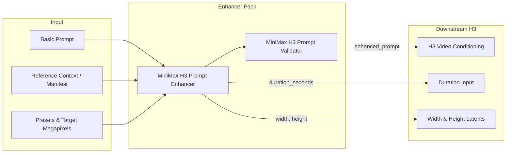

# ComfyUI MiniMax H3 Prompt Enhancer

Production-grade, guide-constrained prompt enhancement, repair, and validation nodes for **MiniMax Hailuo H3** workflows in ComfyUI.

[](LICENSE)
[](pyproject.toml)
[](tests/)
[](#license)

---

## What is this?

MiniMax Hailuo H3 is an advanced audiovisual diffusion model trained on strict, multi-block prompting contracts. Simple prose prompts often lead to audio desync, missing dialogue, or degraded reference fidelity.

This node pack transforms simple natural language ideas and multimodal reference assets into **flawless, officially compliant MiniMax H3 audiovisual prompts** through:
1. **OpenAI-compatible APIs** (LM Studio, Ollama, OpenAI, Groq, OpenRouter).
2. **Local GGUF models** running via isolated, auto-managed `llama-server` instances with deterministic VRAM reclaim.
3. **Model-free Guide Builder & Validator nodes** for custom LLM graphs.

---

## Feature Comparison

| Capability | Generic Enhancers / RunComfy | **ComfyUI-MiniMax-H3-Prompt-Enhancer** |
|---|---|---|
| **H3 Prompt Contracts** | Single unstructured block | **Strict 6-Block Anatomy** (Ref2VA) & **3-Block Structure** (T2VA/I2VA/FL2VA/L2VA) |
| **Dialogue Fidelity** | Translates or paraphrases quotes | **100% Verbatim Spoken Dialogue** in `<d>[Language] ...</d>` blocks |
| **Multilingual & Dialects** | Generic or broken `[Original language]` | **18+ Canonical Languages & Dialects** (Castilian, Québécois, Flemish, etc.) |
| **Audio Reference Binding** | Treated as background noise | **Cross-Modal Voice Binding** (`<Audio N>` $\rightarrow$ `<Subject N> (Sx)`) |
| **Visual Text vs Speech** | Signs converted into dialogue | **Intelligent Separation** of signs/shirts/doors from spoken character dialogue |
| **Resolution & MP Scaling** | Manual calculation | **Direct `width` & `height` Outputs** aligned to 16px from Aspect Ratio & `target_megapixels` (0.2–2.0+ MP) |
| **Visual Style Presets** | Generic prompt words | **53 Direct Preset Styles** + 131+ Curated Profiles & 13-Axis Cinematography Engine |
| **Token Calibration** | Fixed or overflowing lengths | **Adaptive Description Budget** matching H3's cross-attention sweet spot |
| **Validation & Self-Repair** | None | **Strict Syntactic Validation Gate** with automatic LLM repair loop |
| **VRAM Management** | May leak memory in ComfyUI | **Isolated Process Execution** with instant 100% VRAM release before diffusion |

---

## Documentation Hub

Explore the specialized guides in [`docs/`](docs/):

| Guide | Description |
|---|---|
| 📜 [**Prompt Contracts & Modes**](docs/prompt_contracts.md) | Full specifications for T2VA, Ref2VA, I2VA, FL2VA, L2VA, Chained Multishot, Frame Grid Math ($17 \times n + 5$), and Megapixel Scaling. |
| 🎙️ [**Dialogue & Audio Architecture**](docs/dialogue_and_audio.md) | Multilingual engine, dialect recognition, audio reference binding (`<Audio N>`), and acoustic space policies. |
| 🎨 [**Style Bible & Cinematography**](docs/style_bible_and_cinematography.md) | Complete catalog of 53 Visual Languages, 20 World Aesthetics, 18 Tones, 12 Genres, 18 Content Formats, and 13 Cinematography Axes. |
| 🖼️ [**Media References & Manifests**](docs/media_references_and_manifests.md) | Plain-text reference context vs structured JSON manifests, subject mapping, and retention analysis. |
| ⚙️ [**Architecture, GGUF & Memory**](docs/architecture_and_gguf.md) | Standalone `llama-server` architecture, local GGUF discovery, memory reclaim policies, and troubleshooting. |

---

## Quick Start

### 1. Using LM Studio / Ollama (OpenAI-compatible API)

1. Start your local server (e.g. LM Studio at `http://127.0.0.1:1234/v1` or Ollama at `http://127.0.0.1:11434/v1`).
2. Add **MiniMax H3 Prompt Enhancer** to your canvas from `MiniMax H3 → Prompting`.
3. Select **OpenAI-compatible API**, enter your endpoint URL, and click **Refresh API model list**.
4. Choose your model, enter your basic prompt, and connect `enhanced_prompt` to your downstream H3 conditioning node.

### 2. Using Local GGUF (Direct llama-server)

1. Place any quantized `.gguf` model in `ComfyUI/models/llm_gguf/`.
2. Add **MiniMax H3 GGUF Prompt Enhancer** to your canvas.
3. Select your `.gguf` file from the dropdown.
4. Leave `keep_server_loaded = false` to start the server during prompt enhancement and immediately reclaim 100% of your GPU VRAM before MiniMax H3 begins sampling.

---

## Ready-to-Use Example Workflows

Drag and drop any of these JSON workflows from [`examples/`](examples/) directly into ComfyUI:

1. 🎬 [**`01_T2VA_Cinematic_Dialogue_and_Score.json`**](examples/01_T2VA_Cinematic_Dialogue_and_Score.json): Text-to-Video generation with verbatim Spanish dialogue, jazz instrumental score, and automatic `16:9` (`1280x720`) resolution outputs.
2. 🎭 [**`02_Ref2VA_Character_Identity_and_Voice_Clone.json`**](examples/02_Ref2VA_Character_Identity_and_Voice_Clone.json): Multimodal reference generation using Picture references for character identity and Audio references (`<Audio 1>`) for vocal cloning.
3. ⚡ [**`03_FL2VA_Keyframe_Interpolation.json`**](examples/03_FL2VA_Keyframe_Interpolation.json): First-and-last frame interpolation with physical micro-foley and speed ramp staging.
4. 🚀 [**`04_Chained_Multishot_Autonomous.json`**](examples/04_Chained_Multishot_Autonomous.json): Chained 3-shot sequence with `MiniMaxH3ShotSelector` and multi-shot identity locks.

---

## Core Nodes Overview



1. **`MiniMaxH3PromptEnhancer`**: Remote API / OpenAI-compatible endpoint prompt enhancer with self-repair loop and direct resolution outputs (`width`, `height`).
2. **`MiniMaxH3GGUFPromptEnhancer`**: Direct local GGUF prompt enhancer with automatic process lifecycle management and resolution outputs.
3. **`MiniMaxH3PromptGuideBuilder`**: Compiles system prompts and user instructions for existing ComfyUI LLM nodes.
4. **`MiniMaxH3PromptValidator`**: Standalone structural validator checking 6-block contracts, tags, dialogue, and reference counts.
5. **`MiniMaxH3MediaManifestValidator`**: Pre-validates structured JSON media inventories before prompting.
6. **`MiniMaxH3ChainedMultishotOutput`**: Routes multi-prompt JSON arrays to independent chained generation passes.

---

## Key Highlights

### Direct Resolution Outputs & Megapixel Scaling (`target_megapixels`)
All enhancer nodes output calibrated `width` and `height` integer slots compatible with downstream video samplers and empty latent generators.
- **Default (`0.0`)**: Standard MiniMax H3 720p base (`1280x720` for 16:9, `720x1280` for 9:16, `1080x1080` for 1:1, `1680x720` for 21:9).
- **Custom Megapixels**: Enter any float target (e.g. `0.2` MP $\rightarrow$ `592x336`, `0.3` MP $\rightarrow$ `736x416`, `0.5` MP $\rightarrow$ `944x528`, `2.0` MP $\rightarrow$ `1888x1056`) automatically rounded to the nearest multiple of 16.

### One-Click Visual Style Presets (`visual_style_preset`)
Instant dropdown selection for every curated directorial style (`live_action_cinematic`, `1970s_new_hollywood`, `anime_ultradetailed_cinematic`, `stylized_3d_animation`, `stop_motion_handcrafted`, `supermarionation`, `giallo`, `live_action_visceral_horror`, etc.) without writing manual JSON schemas.

The list is derived from the catalogue instead of maintained by hand, so the dropdown and the profiles cannot drift apart.

This preset fills **one axis only**: `visualLanguage`. Genre, world aesthetic, and tone are separate axes that stack on top of it — a `film_noir` world aesthetic keeps tinting the shot in low-key chiaroscuro whichever visual language you select.

### Multilingual & Dialect Recognition
Spoken dialogue is preserved verbatim in its natural language while all structural prose is translated into English for H3:
```text
The woman (S1) says in Spanish from Spain: <d>[Spanish] Hola, cariño, ¿quieres un baile privado?</d>.
```
Supports 18+ canonical languages and dozens of regional dialects (Castilian, Québécois, Flemish, Austrian German, Brazilian Portuguese, Cantonese, etc.).

### Cross-Modal Audio Reference Binding
Binds audio tracks (`<Audio 1>`, `<Audio 2>`) directly to character identities (`(S1)`, `(S2)`):
```text
<Audio 1> is the supplied audio signal used exclusively as the voice-timbre and delivery reference for <Subject 1> (S1)'s newly generated dialogue.
```

### Non-Destructive Style Bible & Directing Engine
Choose from **131+ curated profiles** (53 visual languages, 20 world aesthetics, 18 tones, 12 genres, 18 content formats) and **13 cinematography dimensions** (optics, depth of field, color grading, camera speed/amplitude). Explicit user facts in the prompt always take absolute precedence over styles.

Each profile carries a `must_not_invent` list, emitted as `forbidden_inventions`. It bars the **profile** from adding those things on its own initiative; it never overrides you. `supermarionation` forbids visible strings so the style cannot drag in a puppet gag by itself — ask for strings in your prompt and you get them.

### Creative Latitude (`creative_latitude`)
One dropdown for how far the writer may go beyond what you typed:

| level | behaviour |
|---|---|
| `verbatim_source` | **none** — keeps your wording, facts, order and terseness exactly as written. Only reformats into the H3 sections, applies the selected style, and resolves delivery marks |
| `conservative_grounded` | adds only the minimum executable structure the H3 mode requires |
| `enhanced_production` *(default)* | resolves unspecified production decisions — composition, blocking, lighting, micro-performance |
| `invented_production` | treats the source as a premise and builds the world around it: supporting presence, props, set dressing, background life, and the sound it causes |

This replaces the former `enhance_description` and `invent_scene` booleans, which spanned four states for three meanings — and the spare one lied, running the most conservative profile while the UI promised an invented scene. Workflows saved with the old pair are converted on load.

`verbatim_source` is not the same as `conservative_grounded`: the conservative profile is *required* to expand ("do not preserve source terseness when the mode requires structure"), while the verbatim one is required not to. Reach for it when the description is already finished writing.

Invention never touches what is yours. Quoted dialogue, the identity and role of every supplied reference, the requested duration, shot count and ending, and the source's level of gore stay locked at every level.

### Dialogue Delivery Marks & Emoji Palette

Type delivery shorthand next to a line and it is resolved into the prose form H3 actually documents. A palette of one-click buttons sits under `basic_prompt`.

```text
La mujer se gira 😠 "No me toques"
El hombre responde 🤫 "Por favor… escúchame ⏸️ un momento"
```

becomes, per line:

```text
- "No me toques" → in a hard, angry voice
- "Por favor… escúchame… un momento" → whispers; a held beat of silence at that point
```

**Verified on a real generation.** Two emoji in, one T2VA render out:

```text
in   She says 😠 "No me toques". He answers 🤫 "Por favor, escúchame".

out  The woman (S1) speaks with a hard, angry voice while saying <d>[Spanish] No me toques</d>.
     The man (S2) replies with a whispered tone, stating <d>[Spanish] Por favor, escúchame</d>.
```

Delivery landed outside `<d>`, each mark stayed on its own speaker, the Spanish survived verbatim inside the tag, and no emoji reached the model.

**Why translation rather than pass-through.** H3 has no emotion-tag syntax at all. Its published skill (`MiniMax-AI/MiniMax-H3`, `.claude/skills/h3-prompt-writing`) puts the speaker's delivery in plain prose *outside* `<d>` and allows only the language tag plus the exact words inside it. `[whispering]`, `(laughs)`, `*sighs*` and `<break time="1s">` are ElevenLabs/Bark syntax — H3 would read them as words to speak. So every mark is resolved here and stripped from the spoken words, the dialogue contract, and the echoed prompt.

Marks bind to a line by proximity, so two speakers each keep their own delivery instead of sharing a pooled list. Bracket aliases (`[enfadada]`, `[susurro]`, `[pausa]`, ~30 in Spanish and English) work the same way, and official H3 brackets (`[Shot 2]`, `[English]`, `[unclear]`) are never touched.

Emoji backed by a **documented vocal verb** are marked with a green border in the palette, because a verb the guide spells out is a safer instruction than an invented adverb:

| | verb | | prose |
|---|---|---|---|
| 💬 | `says` | 😠 | hard, angry voice |
| 🤫 | `whispers` | 😢 | low, unsteady, close to tears |
| 😡 | `shouts` | 😭 | through tears |
| ❓ | `asks` | 😨 | thin, frightened voice |
| 🎤 | `sings` | 😀 | bright, warm voice |
| 📢 | `says in an off-screen voiceover` | 😂 | through laughter |
| | | 😏 | flat, sardonic tone |
| | | 😐 | cold, level voice |
| | | 🥱 | slow, weary voice |
| | | ⚡ | quick, urgent voice |
| | | 🫢 | hushed, breathy voice |

The prose column follows the axes the guide names for a speaker — pitch, timbre, speaking rate, accent — phrased like its own examples (*"The young woman with a quiet, breathy voice (S1) says:"*).

⏸️ **is our own convention, not a documented one.** The official guides contain no pause mechanism whatsoever; the only temporal lever they define is shot timestamps. It is rendered as an ellipsis inside the quote, leaning on the rule that punctuation must be preserved verbatim. Worth A/B testing before relying on it.

The validator fails a finished prompt that still contains any shorthand, naming the leaked mark. Previously a stray bracket surfaced only indirectly as "invented dialogue" — pointing at the wrong cause — and a stray emoji was not caught at all.

### LoRA Trigger Words (`lora_trigger_words`)

Type the trigger tokens for any LoRA in the graph — `g0r3_style, ultrarealistic_v2` — and they are appended to the finished prompt **verbatim**.

They deliberately never pass through the LLM. A trigger is an exact token the LoRA was trained on, so `g0r3_style` has to survive character for character; sent through the writer it would be translated into fluent English like everything else. It would also fail the rule that every sentence name something a camera could record — correctly, because a token is not something a camera can record.

So the tokens are injected **after validation**, where a repair pass can no longer rewrite them and no English-expecting check can trip over them. They land inside the description body (`integrated_multimodal_description`, or `detailed_description` in Ref2VA) rather than after the last section, because a trailing line gets parsed as part of `non_diegetic_music` and breaks the three-field contract.

### Speech-Cue Recognition

Source dialogue is detected from quoted text next to a speech cue. That cue list now covers the ordinary verbs writers actually reach for — `answers`, `murmurs`, `mutters`, `mumbles`, `yells`, `screams`, `insists`, `pleads`, `begs` — alongside `says`, `replies`, `asks`, `shouts`, `whispers`, `sings` and their Spanish equivalents.

`answers` was missing, which had a nasty shape: the user's own line went undetected as source dialogue and validation then rejected it as **invented** dialogue, blaming the writer for text the user had typed. A cue only counts immediately beside a quoted string, so these verbs cannot fire on ordinary prose — *He repeats the gesture and picks up "the red book"* is still not dialogue.

---

## Installation

### Via ComfyUI Manager
Search for `ComfyUI-MiniMax-H3-Prompt-Enhancer` in the ComfyUI Manager and install.

### Manual Installation
```bash
cd ComfyUI/custom_nodes
git clone https://github.com/hyukudan/ComfyUI-MiniMax-H3-Prompt-Enhancer.git
```

No external Python dependencies are required beyond ComfyUI's standard environment.

---

## License

Distributed under the **GNU General Public License v3.0 (GPL-3.0)**. See [LICENSE](LICENSE) for details.
