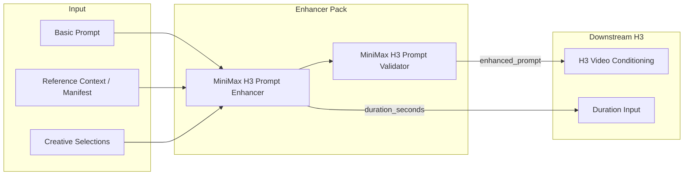

# ComfyUI MiniMax H3 Prompt Enhancer

Production-grade, guide-constrained prompt enhancement, repair, and validation nodes for **MiniMax Hailuo H3** workflows in ComfyUI.

[](LICENSE)
[](pyproject.toml)
[](tests/)
[](#license)

---

## What is this?

MiniMax Hailuo H3 is an advanced audiovisual diffusion model trained on strict, multi-block prompting contracts. Simple prose prompts often lead to audio desync, missing dialogue, or degraded reference fidelity.

This node pack transforms simple natural language ideas and multimodal reference assets into **flawless, officially compliant MiniMax H3 audiovisual prompts** through:
1. **OpenAI-compatible APIs** (LM Studio, Ollama, OpenAI, Groq, OpenRouter).
2. **Local GGUF models** running via isolated, auto-managed `llama-server` instances with deterministic VRAM reclaim.
3. **Model-free Guide Builder & Validator nodes** for custom LLM graphs.

---

## Feature Comparison

| Capability | Generic Enhancers / RunComfy | **ComfyUI-MiniMax-H3-Prompt-Enhancer** |
|---|---|---|
| **H3 Prompt Contracts** | Single unstructured block | **Strict 6-Block Anatomy** (Ref2VA) & **3-Block Structure** (T2VA/I2VA/FL2VA/L2VA) |
| **Dialogue Fidelity** | Translates or paraphrases quotes | **100% Verbatim Spoken Dialogue** in `<d>[Language] ...</d>` blocks |
| **Multilingual & Dialects** | Generic or broken `[Original language]` | **18+ Canonical Languages & Dialects** (Castilian, Québécois, Flemish, etc.) |
| **Audio Reference Binding** | Treated as background noise | **Cross-Modal Voice Binding** (`<Audio N>` $\rightarrow$ `<Subject N> (Sx)`) |
| **Visual Text vs Speech** | Signs converted into dialogue | **Intelligent Separation** of signs/shirts/doors from spoken character dialogue |
| **Style Bible & Directing** | Generic buzzwords | **131+ Curated Profiles** + 13-axis Cinematography with Conflict Precedence |
| **Token Calibration** | Fixed or overflowing lengths | **Adaptive Description Budget** matching H3's cross-attention sweet spot |
| **Validation & Self-Repair** | None | **Strict Syntactic Validation Gate** with automatic LLM repair loop |
| **VRAM Management** | May leak memory in ComfyUI | **Isolated Process Execution** with instant 100% VRAM release before diffusion |

---

## Documentation Hub

Explore the specialized guides in [`docs/`](docs/):

| Guide | Description |
|---|---|
| 📜 [**Prompt Contracts & Modes**](docs/prompt_contracts.md) | Full specifications for T2VA, Ref2VA, I2VA, FL2VA, L2VA, Chained Multishot, and Frame Grid Math ($17 \times n + 5$). |
| 🎙️ [**Dialogue & Audio Architecture**](docs/dialogue_and_audio.md) | Multilingual engine, dialect recognition, audio reference binding (`<Audio N>`), and acoustic space policies. |
| 🎨 [**Style Bible & Cinematography**](docs/style_bible_and_cinematography.md) | Complete catalog of 53 Visual Languages, 20 World Aesthetics, 18 Tones, 12 Genres, 18 Content Formats, and 13 Cinematography Axes. |
| 🖼️ [**Media References & Manifests**](docs/media_references_and_manifests.md) | Plain-text reference context vs structured JSON manifests, subject mapping, and retention analysis. |
| ⚙️ [**Architecture, GGUF & Memory**](docs/architecture_and_gguf.md) | Standalone `llama-server` architecture, local GGUF discovery, memory reclaim policies, and troubleshooting. |

---

## Quick Start

### 1. Using LM Studio / Ollama (OpenAI-compatible API)

1. Start your local server (e.g. LM Studio at `http://127.0.0.1:1234/v1` or Ollama at `http://127.0.0.1:11434/v1`).
2. Add **MiniMax H3 Prompt Enhancer** to your canvas from `MiniMax H3 → Prompting`.
3. Select **OpenAI-compatible API**, enter your endpoint URL, and click **Refresh API model list**.
4. Choose your model, enter your basic prompt, and connect `enhanced_prompt` to your downstream H3 conditioning node.

### 2. Using Local GGUF (Direct llama-server)

1. Place any quantized `.gguf` model in `ComfyUI/models/llm_gguf/`.
2. Add **MiniMax H3 GGUF Prompt Enhancer** to your canvas.
3. Select your `.gguf` file from the dropdown.
4. Leave `keep_server_loaded = false` to start the server during prompt enhancement and immediately reclaim 100% of your GPU VRAM before MiniMax H3 begins sampling.

---

## Ready-to-Use Example Workflows

Drag and drop any of these JSON workflows from [`examples/`](examples/) directly into ComfyUI:

1. 🎬 [**`01_T2VA_Cinematic_Dialogue_and_Score.json`**](examples/01_T2VA_Cinematic_Dialogue_and_Score.json): Text-to-Video generation with verbatim Spanish dialogue, jazz instrumental score, and automatic `16:9` (`1280x720`) resolution outputs.
2. 🎭 [**`02_Ref2VA_Character_Identity_and_Voice_Clone.json`**](examples/02_Ref2VA_Character_Identity_and_Voice_Clone.json): Multimodal reference generation using Picture references for character identity and Audio references (`<Audio 1>`) for vocal cloning.
3. ⚡ [**`03_FL2VA_Keyframe_Interpolation.json`**](examples/03_FL2VA_Keyframe_Interpolation.json): First-and-last frame interpolation with physical micro-foley and speed ramp staging.
4. 🚀 [**`04_Chained_Multishot_Autonomous.json`**](examples/04_Chained_Multishot_Autonomous.json): Chained 3-shot sequence with `MiniMaxH3ShotSelector` and multi-shot identity locks.

---

## Core Nodes Overview



1. **`MiniMaxH3PromptEnhancer`**: Remote API / OpenAI-compatible endpoint prompt enhancer with self-repair loop.
2. **`MiniMaxH3GGUFPromptEnhancer`**: Direct local GGUF prompt enhancer with automatic process lifecycle management.
3. **`MiniMaxH3PromptGuideBuilder`**: Compiles system prompts and user instructions for existing ComfyUI LLM nodes.
4. **`MiniMaxH3PromptValidator`**: Standalone structural validator checking 6-block contracts, tags, dialogue, and reference counts.
5. **`MiniMaxH3MediaManifestValidator`**: Pre-validates structured JSON media inventories before prompting.
6. **`MiniMaxH3ChainedMultishotOutput`**: Routes multi-prompt JSON arrays to independent chained generation passes.

---

## Key Highlights

### Multilingual & Dialect Recognition
Spoken dialogue is preserved verbatim in its natural language while all structural prose is translated into English for H3:
```text
The woman (S1) says in Spanish from Spain: <d>[Spanish] Hola, cariño, ¿quieres un baile privado?</d>.
```
Supports 18+ canonical languages and dozens of regional dialects (Castilian, Québécois, Flemish, Austrian German, Brazilian Portuguese, Cantonese, etc.).

### Cross-Modal Audio Reference Binding
Binds audio tracks (`<Audio 1>`, `<Audio 2>`) directly to character identities (`(S1)`, `(S2)`):
```text
<Audio 1> is the supplied audio signal used exclusively as the voice-timbre and delivery reference for <Subject 1> (S1)'s newly generated dialogue.
```

### Non-Destructive Style Bible & Directing Engine
Choose from **131+ curated profiles** (53 visual languages, 20 world aesthetics, 18 tones, 12 genres, 18 content formats) and **13 cinematography dimensions** (optics, depth of field, color grading, camera speed/amplitude). Explicit user facts in the prompt always take absolute precedence over styles.

---

## Installation

### Via ComfyUI Manager
Search for `ComfyUI-MiniMax-H3-Prompt-Enhancer` in the ComfyUI Manager and install.

### Manual Installation
```bash
cd ComfyUI/custom_nodes
git clone https://github.com/hyukudan/ComfyUI-MiniMax-H3-Prompt-Enhancer.git
```

No external Python dependencies are required beyond ComfyUI's standard environment.

---

## License

Distributed under the **GNU General Public License v3.0 (GPL-3.0)**. See [LICENSE](LICENSE) for details.
