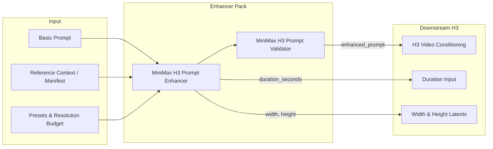

# ComfyUI MiniMax H3 Prompt Enhancer

Production-grade, guide-constrained prompt enhancement, repair, and validation nodes for **MiniMax Hailuo H3** workflows in ComfyUI.

[](LICENSE)
[](pyproject.toml)
[](tests/)
[](#license)

---

## What is this?

MiniMax Hailuo H3 is an advanced audiovisual diffusion model trained on strict, multi-block prompting contracts. Simple prose prompts often lead to audio desync, missing dialogue, or degraded reference fidelity.

This node pack transforms simple natural language ideas and multimodal reference assets into **flawless, officially compliant MiniMax H3 audiovisual prompts** through:
1. **OpenAI-compatible APIs** (LM Studio, Ollama, OpenAI, Groq, OpenRouter).
2. **Local GGUF models** running via isolated, auto-managed `llama-server` instances with deterministic VRAM reclaim.
3. **Model-free Guide Builder & Validator nodes** for custom LLM graphs.

---

## Feature Comparison

| Capability | Generic Enhancers / RunComfy | **ComfyUI-MiniMax-H3-Prompt-Enhancer** |
|---|---|---|
| **H3 Prompt Contracts** | Single unstructured block | **Strict 6-Block Anatomy** (Ref2VA) & **3-Block Structure** (T2VA/I2VA/FL2VA/L2VA) |
| **Dialogue Fidelity** | Translates or paraphrases quotes | **100% Verbatim Spoken Dialogue** in `<d>[Language] ...</d>` blocks |
| **Multilingual & Dialects** | Generic or broken `[Original language]` | **17 Canonical Languages + 88 Dialect Aliases** (Castilian, Québécois, Flemish, etc.) |
| **Audio Reference Binding** | Treated as background noise | **Cross-Modal Voice Binding** (`<Audio N>` $\rightarrow$ `<Subject N> (Sx)`) |
| **Visual Text vs Speech** | Signs converted into dialogue | **Intelligent Separation** of signs/shirts/doors from spoken character dialogue |
| **Titles & Credits** | Loose text requests and unstable spelling | **Seven deterministic cinematic recipes**, timed readable holds, exact text lock, hierarchy, fit checks, and final-frame preservation |
| **Resolution & MP Scaling** | Manual calculation | **Direct `width` & `height` Outputs** aligned to 16 px from Aspect Ratio (shape) and Resolution Budget (area: Auto or Custom MP) |
| **Visual Style Presets** | Generic prompt words | **52 Direct Preset Styles** + 116 Curated Profiles & 13-Axis Cinematography Engine |
| **Token Calibration** | Fixed or overflowing lengths | **Adaptive Description Budget** matching H3's cross-attention sweet spot |
| **Validation & Self-Repair** | None | **Strict Syntactic Validation Gate** with automatic LLM repair loop |
| **Production Planning** | Prompt prose or disconnected form fields | **Prompt Studio** with stateful shots, subjects, appearance states, environments, per-generation references, camera ownership, and structured diagnostics |
| **VRAM Management** | May leak memory in ComfyUI | **Isolated Process Execution** with instant 100% VRAM release before diffusion |

---

## Documentation Hub

Explore the specialized guides in [`docs/`](docs/):

| Guide | Description |
|---|---|
| 📜 [**Prompt Contracts & Modes**](docs/prompt_contracts.md) | Full specifications for T2VA, Ref2VA, I2VA, FL2VA, L2VA, Chained Multishot, Frame Grid Math ($17 \times n + 5$), and Megapixel Scaling. |
| 🎛️ [**Prompt Studio**](docs/prompt_studio.md) | Compact dashboard and wide responsive drawer, v2 planning contracts, appearance and environment continuity, logical-reference bindings, camera authority, Coach diagnostics, and no-clobber migration. |
| 🎙️ [**Dialogue & Audio Architecture**](docs/dialogue_and_audio.md) | Multilingual engine, dialect recognition, audio reference binding (`<Audio N>`), and acoustic space policies. |
| 🎨 [**Style Bible & Cinematography**](docs/style_bible_and_cinematography.md) | Complete catalog of 61 Visual Languages, 19 World Aesthetics, 17 Tones, 11 Genres, 17 Content Formats, and 13 Cinematography Axes. |
| 🖼️ [**Media References & Manifests**](docs/media_references_and_manifests.md) | Plain-text reference context vs structured JSON manifests, subject mapping, and retention analysis. |
| ✦ [**Cinematic Titles & Credits**](docs/titles_and_credits.md) | Seven material/directorial recipes, exact title and credit syntax, timing, readability validation, and local workflow testing. |
| ⚙️ [**Architecture, GGUF & Memory**](docs/architecture_and_gguf.md) | Standalone `llama-server` architecture, local GGUF discovery, memory reclaim policies, and troubleshooting. |

---

## Quick Start

### 1. Using LM Studio / Ollama (OpenAI-compatible API)

1. Start your local server (e.g. LM Studio at `http://127.0.0.1:1234/v1` or Ollama at `http://127.0.0.1:11434/v1`).
2. Add **MiniMax H3 Prompt Enhancer** to your canvas from `MiniMax H3 → Prompting`.
3. Select **OpenAI-compatible API**, enter your endpoint URL, and click **Refresh API model list**.
4. Choose your model, enter your basic prompt, and connect `enhanced_prompt` to your downstream H3 conditioning node.

### 2. Using Local GGUF (Direct llama-server)

1. Place any quantized `.gguf` model in `ComfyUI/models/llm_gguf/`.
2. Add **MiniMax H3 GGUF Prompt Enhancer** to your canvas.
3. Select your `.gguf` file from the dropdown.
4. Leave `keep_server_loaded = false` to start the server during prompt enhancement and immediately reclaim 100% of your GPU VRAM before MiniMax H3 begins sampling.

---

## Ready-to-Use Example Workflows

Drag and drop any of these JSON workflows from [`examples/`](examples/) directly into ComfyUI:

1. 🎬 [**`01_T2VA_Cinematic_Dialogue_and_Score.json`**](examples/01_T2VA_Cinematic_Dialogue_and_Score.json): Text-to-Video generation with verbatim Spanish dialogue, jazz instrumental score, and automatic `16:9` (`1280x720`) resolution outputs.
2. 🎭 [**`02_Ref2VA_Character_Identity_and_Voice_Clone.json`**](examples/02_Ref2VA_Character_Identity_and_Voice_Clone.json): Multimodal reference generation using Picture references for character identity and Audio references (`<Audio 1>`) for vocal cloning.
3. ⚡ [**`03_FL2VA_Keyframe_Interpolation.json`**](examples/03_FL2VA_Keyframe_Interpolation.json): First-and-last frame interpolation with physical micro-foley and speed ramp staging.
4. 🚀 [**`04_Chained_Multishot_Autonomous.json`**](examples/04_Chained_Multishot_Autonomous.json): Chained 3-shot sequence with `MiniMaxH3ShotSelector` and multi-shot identity locks.

---

## Core Nodes Overview



1. **`MiniMaxH3PromptEnhancer`**: Remote API / OpenAI-compatible endpoint prompt enhancer with self-repair loop and direct resolution outputs (`width`, `height`).
2. **`MiniMaxH3GGUFPromptEnhancer`**: Direct local GGUF prompt enhancer with automatic process lifecycle management and resolution outputs.
3. **`MiniMaxH3PromptGuideBuilder`**: Compiles system prompts and user instructions for existing ComfyUI LLM nodes.
4. **`MiniMaxH3PromptValidator`**: Standalone structural validator checking 6-block contracts, tags, dialogue, and reference counts.
5. **`MiniMaxH3MediaManifestValidator`**: Pre-validates structured JSON media inventories before prompting.
6. **`MiniMaxH3ChainedMultishotOutput`**: Routes multi-prompt JSON arrays to independent chained generation passes.

---

## Key Highlights

### Prompt Studio: Stateful Planning Without New Ports

Prompt Studio now exposes eight areas: **Shots, Staging, Subjects, Environments, Media, Camera, Look, and Review**. Staging arranges each cast member's start/end position, movement, and eyeline. Camera keeps the spatial Anchor separate from each waypoint's Aim target, so a continuous move can pass behind Juan while smoothly reframing from Juan to Olivia. Camera height is shown as a readable scale from **Very low** through **Eye level** to **Very elevated**. In the 3D plan, dragging changes only the camera's X/Z floor position; changing height never pushes it toward the subject or consumes horizontal travel. Instead, the camera icon grows when low and shrinks when high, while Front view shows the vertical coordinate directly. **Distance from anchor** moves it nearer or farther along its current floor direction without changing height. When consecutive positions use different heights, Studio sends an explicit rise, descent, or held-height instruction instead of asking the model to infer it. Lens tilt remains independent: a high camera may keep a horizontal lens or aim downward. The editor stores normalized geometry, while H3 receives names and qualitative natural prose rather than XYZ coordinates, timing percentages, numeric angles, or internal IDs.

The enhancer node stays compact through eight summary chips. Each opens a wide, resizable viewport-level drawer that does not scale with the ComfyUI canvas. It defaults to 720 px on ordinary desktops, 820 px on wide displays, and 920 px on 4K/high-resolution displays; it is bounded between 420 px and `min(1100px, 60vw)`, becomes full-width below 700 px, and stacks master/detail editors on narrow content. The node button changes from **Open Studio** to **Close Studio** while its drawer is open; `Esc` and the header close button do the same and return focus to the node. Every deliberate editor change is saved immediately into that node's v2 workflow data—there is no separate Save button. The **Guided / Advanced** selector lives inside **Look**, the only area it affects. The Studio edits the existing structured widgets and adds no ports or duplicate project storage.

Instructional examples inside empty authoring fields are placeholders, not saved prompt text. They disappear when the field receives focus, return only if it is left empty, and never become JSON automatically. Review blocks generation when a required identity, dialogue line, or custom relationship is still unfinished.

Prompt Studio plans what H3 should do; it does not carry image/video tensors or upload files. The two paths meet at the H3 generation node:

```text
Idea → Prompt Enhancer / Prompt Studio → enhanced_prompt ───────────────┐
Load Image / Load Video / audio source → physical H3 media inputs ────┼→ H3 generation node
Add reference → logical reference → generation binding / physical slot ┘
```

Use **Shots** for visible beats, timed action/dialogue spans, scale, transitions, and compact camera context; **Staging** for cast positions, movement, and eyelines; **Subjects** for identity and appearances; **Environments** for places and states; **Media** for references and physical slots; **Camera** for the selected shot's visual route and named aim targets; **Look** for creative direction and global cinematography; and **Review** for diagnostics. Look keeps Mood separate from line-level Delivery and Voice color, and its Visual Language browser uses family → era/technique → variant. Camera, Staging, and Shots edit the same `shot_plan_json` v2 object rather than duplicate data. In T2V, media may remain empty; I2V and reference workflows still connect their physical files directly to H3.

Every Shot needs a visible **Action**, but the common one-shot workflow does not require duplicate typing. A newly created Shot copies the current Basic prompt as an editable starting point; an existing single Shot with an empty Action inherits the Basic prompt at generation time without rewriting its saved JSON. Use **Use Basic prompt as Action** to materialize that inheritance, or replace it with more precise per-shot wording. Multiple Shots still require their own Actions because distributing one Basic prompt across several rows is ambiguous.

Creating a Subject defines a reusable identity; active use is explicit so an unused library character cannot leak into a prompt. New subjects are included in the current generation by default. For an existing subject, enable **Subjects → Use in prompts → Always include in Generation …**, or cast it in **Shots → Who’s in it**. Review warns when a saved identity is not active anywhere and therefore will not reach the LLM.

`media_manifest` v2 separates reusable logical references from generation-specific physical bindings. `shot_plan_json` v2 owns when resources appear, subject Staging, action/dialogue beats, and camera Start/Path/End. A spatial path contains 2–6 timed positions. Its one Anchor defines the coordinate origin; every waypoint may independently aim at the anchor, travel direction, a custom direction, or a named subject. Staging lets those named subjects occupy and move through different parts of the frame. H3 receives natural prose and stable names, never raw XYZ, percentage timing, numeric aim angles, or enum tokens.

Media also includes an inline **Plan by outcome** assistant. Choose identity, environment, performance, camera, voice, or continuity and it prepares the logical reference, relationship, shot use, and physical-slot binding together as an atomic v2 update; missing shots, relationships, generation alignment, and slot capacity are reported before any write. Targeted edit, relight, performance-transfer, and continuation recipes reuse those same fields rather than adding recipe data to the schemas. A separate versioned **LLM planning context** export is read-only, local-only, contains no physical files, and has deliberately no auto-import path.

Overview performs immediate local checks before generation and links blocking issues directly to Shots, Media, or Camera. Backend **Review** remains a separate post-run analysis for continuity, camera authority, prompt clarity, and safe repair actions. Review location chips select the related shot and focus the closest exact control, with an honest section-level fallback for output-only locations. Findings can be dismissed by stable fingerprint as a versioned browser-local preference and restored through **Show dismissed** without changing the report or workflow. Executed enhancer/validator results also show total and per-section character counts derived from the emitted prompt, explicitly labeled as a local estimate; the 7,000-character denominator is shown only for API v2 delivery. A blank project also offers three small, brand-safe v2 starter examples. **Import & source tools** stays collapsed at the end and contains a portable Project v2 package transfer for shot, media, creative-treatment, and cinematography documents; physical media files are never embedded. A validated package can either replace the project atomically or append only its generations and shots with collision-safe IDs, rejecting conflicting shared definitions instead of guessing a merge.

Creative Treatment and Cinematography are native v2 documents; v1 remains runtime-compatible but read-only in the Studio until an explicit import validates and writes v2. Structured values are classified before editing as blank, v1, v2, malformed, or future. Loading never writes. Historical `false`/`null` values for Creative Treatment and Cinematography, plus boolean/`null` values left in Shot Plan storage by older controls, are neutral blanks without rewriting their source bytes; the first intentional edit creates v2. An untouched v1 shot plan remains byte-identical and migrates only on the first deliberate edit. Malformed and future JSON remains read-only and is never replaced with defaults, while legacy media manifests continue through their existing backend path without a guessed stateful conversion.

Camera direction is resolved per shot, phase, and aspect. An explicit source fact outranks an authorized video transfer, which outranks a shot plan, global cinematography, generated prose, and creative treatment. A shot overriding a global camera default is normal shadowing, while incompatible explicit owners are reported as configuration errors. A connected video receives no camera authority unless it declares `cameraTransfer`, is active and bound in that generation, and the shot explicitly uses it for named camera aspects.

The existing `validation_report` now includes a versioned `diagnosticReport` with stable codes, locations, blocking policy, repair eligibility, fingerprints, and bounded Prompt Coach advice. The eight enhancer outputs and the direct Python `enhance()` tuple remain unchanged; ComfyUI receives diagnostics through an ephemeral UI payload instead of a new port.

See [Prompt Studio](docs/prompt_studio.md) for the complete UI, schema, authority, diagnostic, migration, and compatibility contract.

### Direct Resolution Outputs: Shape + Area

All enhancer nodes output calibrated `width` and `height` integer slots compatible with downstream video samplers and empty latent generators. **Aspect Ratio** selects the frame shape; **Resolution Budget** selects its approximate pixel area.

- **Auto** uses the H3-oriented default for the chosen shape: `1280×720` for 16:9, `720×1280` for 9:16, `1080×1080` for 1:1, `960×720` for 4:3, `720×960` for 3:4, and `1680×720` for 21:9.
- **Custom MP** targets a megapixel budget while preserving the aspect ratio. Choose **Custom** to enable and focus the always-visible MP field; it accepts any positive finite value, with either a decimal point or comma, and has no artificial minimum or maximum. The effective dimensions update while you edit. Final width and height are aligned to 16-pixel steps and shown live on the node. For 16:9, examples include `0.2 MP → 592×336`, `0.5 MP → 944×528`, and `2.0 MP → 1888×1056`.

Connect the enhancer's `width` and `height` outputs to the H3 generator for this budget to control the rendered video. A separate downstream Resolution Selector remains authoritative if the graph uses it instead; Resolution Budget never adds pixel dimensions to the creative prompt prose.

### One-Click Visual Style Presets (`visual_style_preset`)
Instant dropdown selection for every curated directorial style (`live_action_cinematic`, `1970s_new_hollywood`, `anime_ultradetailed_cinematic`, `stylized_3d_animation`, `stop_motion_handcrafted`, `supermarionation`, `giallo`, `live_action_visceral_horror`, etc.) without writing manual JSON schemas.

The list is derived from the catalogue instead of maintained by hand, so the dropdown and the profiles cannot drift apart.

This preset fills **one axis only**: `visualLanguage`. Genre, world aesthetic, and tone are separate axes that stack on top of it — a `film_noir` world aesthetic keeps tinting the shot in low-key chiaroscuro whichever visual language you select.

### Cinematic Titles & Credits

The main **MiniMax H3 Prompt Enhancer** can turn a concept into a complete cinematic title sequence while keeping every supplied character exact. Set **Titles & Credits recipe** to anything except `none`, choose an energy, then enter the main title and credits.

```text
Exact main title:
THE SIGNAL

Credit cards — one per line:
A FILM BY | MALAK
MUSIC BY | ANA TORRES
```

`Role | Name` creates a hierarchical credit card; a line without `|` creates a single-level card. Title line breaks are intentional and preserved. The director plans formation, settling, a completely still readable hold, causal transitions, synchronized sourced sound, and a final title composition that remains through the last frame. It rejects sequences that cannot fit the chosen duration or aspect ratio instead of silently producing unreadable cards.

The seven recipes are **Auto director**, **Prestige imprint**, **Precision apparatus**, **Analog print lab**, **Unearthed archive**, **Optical luxury**, and **Living material**. The feature supports ordinary `auto`, T2VA and reference modes; it deliberately refuses `chained_multishot`, whose JSON output cannot carry one authoritative cross-shot text lock. See [Cinematic Titles & Credits](docs/titles_and_credits.md) for complete controls, constraints and testing instructions.

### Multilingual & Dialect Recognition
Spoken dialogue is preserved verbatim in its natural language while all structural prose is translated into English for H3:
```text
The woman (S1) says in Spanish from Spain: <d>[Spanish] Hola, cariño, ¿quieres un baile privado?</d>.
```
Supports 17 canonical languages and 88 regional dialect aliases (Castilian, Québécois, Flemish, Austrian German, Brazilian Portuguese, Cantonese, etc.).

### Cross-Modal Audio Reference Binding
Binds audio tracks (`<Audio 1>`, `<Audio 2>`) directly to character identities (`(S1)`, `(S2)`):
```text
<Audio 1> is the supplied audio signal used exclusively as the voice-timbre and delivery reference for <Subject 1> (S1)'s newly generated dialogue.
```

### Non-Destructive Style Bible & Directing Engine
Choose from **125 curated profiles** (61 visual languages, 19 world aesthetics, 17 tones, 11 genres, 17 content formats) and **13 cinematography dimensions** (optics, depth of field, color grading, camera speed/amplitude). Explicit user facts in the prompt always take absolute precedence over styles.

Each profile carries a `must_not_invent` list, emitted as `forbidden_inventions`. It bars the **profile** from adding those things on its own initiative; it never overrides you. `supermarionation` forbids visible strings so the style cannot drag in a puppet gag by itself — ask for strings in your prompt and you get them.

### Creative Latitude (`creative_latitude`)
One dropdown for how far the writer may go beyond what you typed:

| level | behaviour |
|---|---|
| `verbatim_source` | **none** — keeps your wording, facts, order and terseness exactly as written. Only reformats into the H3 sections, applies the selected style, and resolves delivery marks |
| `conservative_grounded` | adds only the minimum executable structure the H3 mode requires |
| `enhanced_production` *(default)* | resolves unspecified production decisions — composition, blocking, lighting, micro-performance |
| `invented_production` | treats the source as a premise and builds the world around it: supporting presence, props, set dressing, background life, and the sound it causes |

This replaces the former `enhance_description` and `invent_scene` booleans, which spanned four states for three meanings — and the spare one lied, running the most conservative profile while the UI promised an invented scene. Workflows saved with the old pair are converted on load.

`verbatim_source` is not the same as `conservative_grounded`: the conservative profile is *required* to expand ("do not preserve source terseness when the mode requires structure"), while the verbatim one is required not to. Reach for it when the description is already finished writing.

Invention never touches what is yours. Quoted dialogue, the identity and role of every supplied reference, the requested duration, shot count and ending, and the source's level of gore stay locked at every level.

### Dialogue Delivery Marks & Emoji Palette

Type delivery shorthand next to a line and it is resolved into the prose form H3 actually documents. A palette of one-click buttons sits under `basic_prompt`.

```text
The woman turns away 😠 "Don't touch me"
The man answers 🤫 "Please… just listen ⏸️ for a second"
```

becomes, per line:

```text
- "Don't touch me" → in a hard, angry voice
- "Please… just listen… for a second" → whispers; a held beat of silence at that point
```

**Verified on a real generation.** Two emoji in, one T2VA render out:

```text
in   She says 😠 "Don't touch me". He answers 🤫 "Please, listen to me".

out  The woman (S1) speaks with a hard, angry voice while saying <d>[English] Don't touch me</d>.
     The man (S2) replies with a whispered tone, stating <d>[English] Please, listen to me</d>.
```

Delivery landed outside `<d>`, each mark stayed on its own speaker, the Spanish survived verbatim inside the tag, and no emoji reached the model.

**Why translation rather than pass-through.** H3 has no emotion-tag syntax at all. Its published skill (`MiniMax-AI/MiniMax-H3`, `.claude/skills/h3-prompt-writing`) puts the speaker's delivery in plain prose *outside* `<d>` and allows only the language tag plus the exact words inside it. `[whispering]`, `(laughs)`, `*sighs*` and `<break time="1s">` are ElevenLabs/Bark syntax — H3 would read them as words to speak. So every mark is resolved here and stripped from the spoken words, the dialogue contract, and the echoed prompt.

Marks bind to a line by proximity, so two speakers each keep their own delivery instead of sharing a pooled list. Bracket aliases (`[enfadada]`, `[susurro]`, `[pausa]`, ~30 in Spanish and English) work the same way, and official H3 brackets (`[Shot 2]`, `[English]`, `[unclear]`) are never touched.

The palette separates three jobs that used to look alike: **Delivery** offers six speech verbs, **Channel** adds off-screen V.O., and **Timing** inserts the pause convention. Every control has a visible label and explains its result; keyboard users enter the toolbar once and move through it with the arrow keys.

| | resolves to | | resolves to |
|---|---|---|---|
| 💬 `says` | neutral, even pitch | ❓ `asks` | pitch lifting through the last words |
| 🤫 `whispers` | breath-light and close | 🎤 `sings` | pitch sustained and supported |
| 😡 `shouts` | chest-deep, hard-edged | 🎙️ `V.O.` | off-screen voiceover, lips stay closed |
| 🗣️ `calls out` | projected clearly toward a distant listener | ⏸️ `pause` | our own convention |

Behind **`Voice…`**, the **Voice color** library groups sixteen vocal shades by meaning and shows a text label beside every emoji. The expanded library includes 😌 **calm, steady** and 😰 **trembling**, and its accessible search indexes labels, families, and English/Spanish bracket aliases. It is distinct from scene-wide **Mood (tone)** in Look. Escape first clears a search and then closes the library with focus returned; marks without quoted dialogue produce a non-blocking warning instead of being silently dropped.

| | | | | | |
|---|---|---|---|---|---|
| 😠 hard, low | 😲 stunned | 😨 thin, frightened | 😢 close to tears | 😭 through tears | 🥺 pleading |
| 🥰 tender | 😀 bright, warm | 😂 through laughter | 😏 flat, sardonic | 😐 cold, level | 🥱 slow, weary |
| 😌 calm, steady | 😰 trembling | ⚡ quick, urgent | 🫢 hushed, conspiratorial | | |

The authoring marks remain temporary shorthand: they are written as prose and never appear in the final prompt. Put each mark beside or inside the quoted line it belongs to; use one Delivery verb per line and combine Voice colors freely. The compact status line confirms edits and warns when marks cannot attach to quoted dialogue.

The buttons rest in a neutral state; a mark receives a pressed outline only when it actually exists on the caret's current line. Choosing another Delivery verb replaces the previous verb on that line, while choosing an existing Voice color removes it. **Clear marks on this line** removes only known Delivery/Voice marks from the active line. The last three Voice colors appear as compact **Recent** shortcuts when the node is wide enough. **How marks work** opens floating help without expanding or shifting the prompt area.

The prose column follows the axes the guide names for a speaker — pitch, timbre, speaking rate, accent — phrased like its own examples (*"The young woman with a quiet, breathy voice (S1) says:"*).

**Each mark also drives the face, not just the voice.** H3 renders picture and sound together, so a voice-only instruction can hand you an angry line delivered by a neutral face. Every mark therefore carries a visible cue as well:

```text
- "Get out of my house" → shouts; visible: jaw setting, brows driving hard down as the line breaks out
- "Don't leave me"     → in a low, unsteady voice, close to tears; visible: eyes filling, blink slowing, mouth going unsteady
```

Cues are written as observable behaviour rather than emotion labels, and as a small arc — an opening state, a change, a settled state — because that is the shape the emotional-performance translation asks for and a single frozen state under-seeds it. They stay short and relational on purpose: the same contract rejects muscle lists, pseudo-biometric precision and stacked simultaneous instructions.

### Writing Source Dialogue So the Node Can Help

Two habits get noticeably better results, because the node reads your source rather than guessing.

**Name the speaker before the line.** The delivery contract binds each mark to a person by reading the attribution you already wrote, so `The detective asks 😐 "..."` produces `DETECTIVE, "..." → ...; visible on the detective: ...`. Written as `Someone asks 😐 "..."`, the mark still resolves but arrives unattached, and with two speakers on screen the writer has to guess who wears it.

**Keep the quotation marks.** Everything downstream keys off quoted text: it is what makes a line a verbatim contract the writer may not paraphrase, what the validator checks the output against, and what the marks attach to. A line described rather than quoted — *she tells him to leave* — is treated as direction, not dialogue, and may be rewritten.

If you want the writer to invent the dialogue instead, say so plainly (*"write their dialogue"*). That path is detected and gets the full speaker contract, with the marks applying to whatever it writes.

Marks bind to the **nearest quote**, which is what makes multi-speaker lines work:

```text
The detective asks 😐 "Where were you on Tuesday night".
The suspect answers 😨 "I was home, I swear".
The detective slams the table and shouts 😡 "You are lying to me".
```
```text
- "Where were you on Tuesday night" → in a cold, level voice; visible: face still, gaze level and unblinking…
- "I was home, I swear"             → in a thin, frightened voice; visible: eyes widening, shoulders drawing up…
- "You are lying to me"             → shouts; visible: jaw setting, brows driving hard down as the line breaks out…
```

Two speakers on one line is the ordinary case, and distance is the only rule that handles every arrangement — mark before the quote, after it, several on a line, or one speaker changing emotion between two consecutive lines. Window-based attachment did not: the text between two quotes is the *second* speaker's attribution, so a trailing window read into it and handed the first speaker both marks.

**Cost.** The whole block is ~460 tokens, about 1.4% of the default 32k local context. For comparison a single visual-language profile costs 450–1400, and stacking every treatment axis with the heaviest profile of each reaches 47% of the context including the reply. Delivery marks are among the cheapest things in the prompt.

The contract also states that a mark **is the user establishing that emotion**. This matters more than it looks: the emotional-performance translation is source-gated — it only fires when the source already establishes an emotion — so a bare voice descriptor is ambiguous and a cautious writer treats it as audio-only. Saying it outright also keeps the acting legitimate under `verbatim_source`, where the writer is otherwise forbidden to add anything.

Framing still wins. Where the face is not readable the same beat is carried by posture, breath, gaze or hands, and the writer may not add a cut, push-in or close-up merely to expose it.

📢 is the one mark with **no** visible cue, deliberately: it is an off-screen voiceover, and the official contract requires the on-screen character's lips to stay closed. A face would contradict the spec. A test pins that exception so it does not get "fixed" later.

⏸️ **is our own convention, not a documented one.** The official guides contain no pause mechanism whatsoever; the only temporal lever they define is shot timestamps. It is rendered as an ellipsis inside the quote, leaning on the rule that punctuation must be preserved verbatim. Worth A/B testing before relying on it.

The validator fails a finished prompt that still contains any shorthand, naming the leaked mark. Previously a stray bracket surfaced only indirectly as "invented dialogue" — pointing at the wrong cause — and a stray emoji was not caught at all.

### Physical Action and Its Consequences

H3 improvises whatever a prompt leaves unresolved, and an action named only by its verb is mostly
unresolved. *"A samurai attacks with a katana"* renders as impossible anatomy and a contact that
never lands, because nothing says how the blade travels or what it reaches.

Any action that changes the state of a body, object or surface — a strike, cut, shot, throw,
collision, fall or break — is written as a continuous causal chain in playback order:

| | |
|---|---|
| **Preparation** | stance, grip, load, where the tool starts in frame |
| **Execution** | the travel's path, direction and speed, plus the mechanism's own response: recoil, muzzle flash, blade arc |
| **Contact** | the exact spot, then what **each layer** does, outermost first — cloth splits or parts along the edge, plate dents or deflects, glass stars — and only then the body |
| **Consequence** | the reaction and new posture, what deformed, where the tool ends, what stays visible |

The contact link is the one that decides whether a shot reads as physical. Naming the surface
without saying what happens to it — *"the blade slices through his protective layers"* — is the
commonest way a strike looks fake. The contract asks instead for *"the point punches into the
quilted jacket below the left collarbone, the padded cotton splitting and folding inward around
the steel, and sinks a hand's width into the chest"*.

Sound follows the same chain: the contact is the loudest event in its shot, so the mechanism and
the impact against the named material are placed at that beat, not only the ambience and the
aftermath.

**What it will and will not add.** The test is causation, not intensity. Everything the requested
action causes belongs in the description however graphic it is — the wound at the entry point,
bleeding from it, the flash, the report — because suppressing a caused consequence is what leaves
the chain unresolved in the first place. What the action does not cause stays out. How much
surrounding world may be invented is not decided here at all; that belongs to
[`creative_latitude`](#creative-latitude-creative_latitude), which is why `verbatim_source` never
receives this contract.

Ordinary motion is deliberately exempt: walking, turning, sitting, gesturing or opening a door get
one clause and move on. Full chains are reserved for the two or three actions the request is
actually about; a secondary one is compressed into a single sentence.

**Budget.** ComfyUI does not truncate an H3 prompt, so the local path has no length ceiling; the
7000-character limit applies only when `delivery_target` is `api_v2`. Descriptions grew with this
contract, so `max_tokens` now defaults to 8192 — if a saved workflow still carries a 16384 context
the node refuses to run and reports the exact minimum it needs.

### LoRA Trigger Words (`lora_trigger_words`)

Type the trigger tokens for any LoRA in the graph — `g0r3_style, ultrarealistic_v2` — and they are appended to the finished prompt **verbatim**.

They deliberately never pass through the LLM. A trigger is an exact token the LoRA was trained on, so `g0r3_style` has to survive character for character; sent through the writer it would be translated into fluent English like everything else. It would also fail the rule that every sentence name something a camera could record — correctly, because a token is not something a camera can record.

So the tokens are injected **after validation**, where a repair pass can no longer rewrite them and no English-expecting check can trip over them. They land inside the description body (`integrated_multimodal_description`, or `detailed_description` in Ref2VA) rather than after the last section, because a trailing line gets parsed as part of `non_diegetic_music` and breaks the three-field contract.

### Speech-Cue Recognition

Source dialogue is detected from quoted text next to a speech cue. That cue list now covers the ordinary verbs writers actually reach for — `answers`, `murmurs`, `mutters`, `mumbles`, `yells`, `screams`, `insists`, `pleads`, `begs` — alongside `says`, `replies`, `asks`, `shouts`, `whispers`, `sings` and their Spanish equivalents.

`answers` was missing, which had a nasty shape: the user's own line went undetected as source dialogue and validation then rejected it as **invented** dialogue, blaming the writer for text the user had typed. A cue only counts immediately beside a quoted string, so these verbs cannot fire on ordinary prose — *He repeats the gesture and picks up "the red book"* is still not dialogue.

---

## Installation

### Via ComfyUI Manager
Search for `ComfyUI-MiniMax-H3-Prompt-Enhancer` in the ComfyUI Manager and install.

### Manual Installation
```bash
cd ComfyUI/custom_nodes
git clone https://github.com/hyukudan/ComfyUI-MiniMax-H3-Prompt-Enhancer.git
```

No external Python dependencies are required beyond ComfyUI's standard environment.

---

## License

Distributed under the **GNU General Public License v3.0 (GPL-3.0)**. See [LICENSE](LICENSE) for details.
