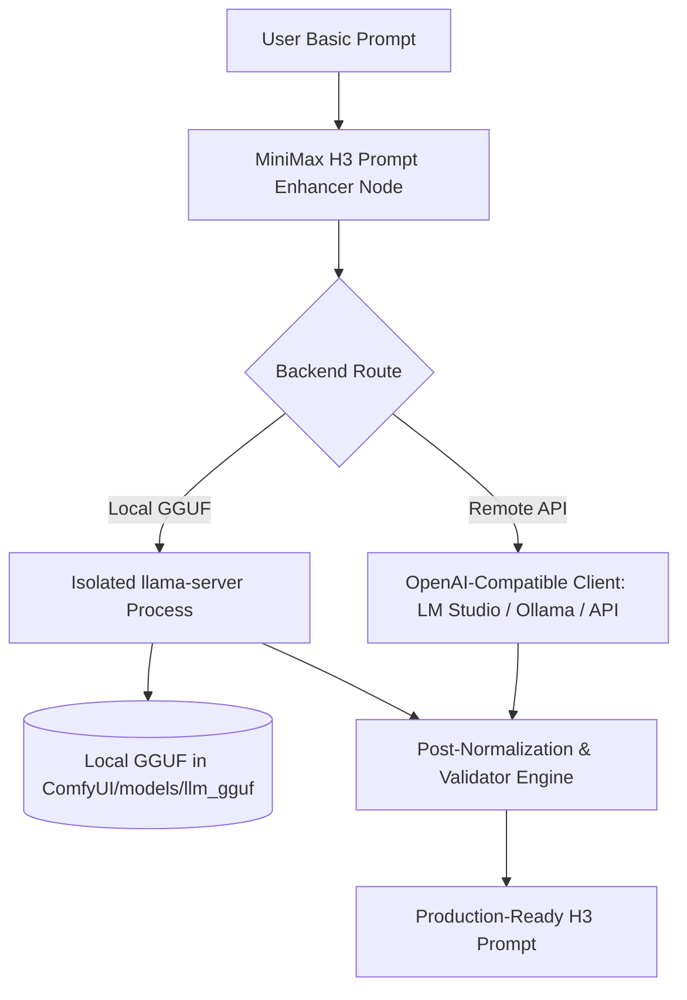

# Architecture, GGUF Execution & Memory Management

This document details the backend architecture, local GGUF execution via standalone `llama-server`, VRAM management policies, and troubleshooting.

---

## Contents

- [Backend Architecture](#backend-architecture)
- [Why Standalone llama-server?](#why-standalone-llama-server)
- [Local GGUF Execution](#local-gguf-execution)
- [Remote API Execution (LM Studio, Ollama, OpenAI)](#remote-api-execution-lm-studio-ollama-openai)
- [Memory Management & VRAM Reclaim Policy](#memory-management--vram-reclaim-policy)
- [Output Diagnostics & Manifest Metadata](#output-diagnostics--manifest-metadata)
- [Troubleshooting & FAQ](#troubleshooting--faq)
- [Developer & Testing Guide](#developer--testing-guide)

---

## Backend Architecture

The package supports two distinct execution paths:



---

## Why Standalone llama-server?

Many custom nodes load `llama-cpp-python` inside the main ComfyUI Python process. This package intentionally spawns an isolated `llama-server` binary:

1. **Deterministic VRAM Reclaim**: Terminating the `llama-server` process immediately frees 100% of GPU VRAM before MiniMax H3 diffusion sampling begins.
2. **Crash Isolation**: A native model fault, CUDA out-of-memory, or segmentation fault inside llama.cpp cannot crash ComfyUI.
3. **No Python Wheel Conflicts**: You can update llama.cpp builds independently without modifying the global Python environment.
4. **Unified API**: Both local GGUF and remote endpoints share the exact same OpenAI-compatible HTTP request and repair pipeline.

---

## Local GGUF Execution

### Prerequisites
1. Place quantized `.gguf` models in `ComfyUI/models/llm_gguf/`.
2. Ensure `llama-server` (or `llama-server.exe`) is available in your PATH or under standard directories.

### Node Configuration
- **Model selector**: Lists discovered GGUF files in your models directory.
- **`n_gpu_layers`**: Number of layers offloaded to GPU (-1 for full offload).
- **`context_size`**: Context window size (recommended: 4096–8192).
- **`keep_server_loaded`**: 
  - `false` (default): Starts server, generates prompt, terminates process, reclaiming all VRAM immediately.
  - `true`: Keeps server in memory between generations for instant responses.

---

## Remote API Execution (LM Studio, Ollama, OpenAI)

Connect to any local or cloud OpenAI-compatible endpoint:

- **LM Studio**: `http://127.0.0.1:1234/v1`
- **Ollama**: `http://127.0.0.1:11434/v1`
- **OpenAI / OpenRouter / Groq**: Supply endpoint URL and API key.

Click **Refresh API model list** to automatically populate available chat models in the widget.

---

## Memory Management & VRAM Reclaim Policy

MiniMax H3 diffusion models require substantial GPU VRAM for video and audio latent generation.

| Workflow Scenario | Recommended Mode | VRAM Impact |
|---|---|---|
| Single GPU (8GB – 16GB) | `keep_server_loaded = false` | 0 MB VRAM retained after prompt generation. |
| Dual GPU / High VRAM (24GB+) | `keep_server_loaded = true` | Fast generation without reload latency. |
| Remote API (LM Studio on secondary PC) | OpenAI-compatible endpoint | 0 MB VRAM used on the ComfyUI machine. |

---

## Output Diagnostics & Manifest Metadata

Both enhancer nodes output comprehensive diagnostic metadata:

- **`manifest_json`**: Indented JSON recording applied creative profiles, resolution digests, dialogue ledger counts, duration math, and exact shot metadata.
- **`treatment_warnings`**: Multi-line string reporting any dropped conflicting tags (e.g. static camera overriding dynamic genre movement).
- **`duration_seconds`**: Float value of the effective calculated duration passed downstream to H3 samplers.

---

## Troubleshooting & FAQ

### 1. Why is dialogue appearing in English when I wrote Spanish?
Check the `dialogue_language` widget on the enhancer node. Ensure it is set to `auto` or `Spanish`. The enhancer automatically preserves quotes and translates only visual scene prose to English.

### 2. Why did my sign text not get generated as dialogue?
Signs, shirts, door cards, and posters (e.g. `"XYZ bar"`, `"1T"`) are identified as visible on-screen text and output as regular quotes. Only character speech belongs inside `<d>[Language] ...</d>` blocks.

### 3. GGUF server failed to start?
Verify that `llama-server.exe` is present in your system PATH or ComfyUI directory, and that `context_size` and `n_gpu_layers` fit within your hardware limits.

---

## Developer & Testing Guide

Run the full pytest suite to verify all prompt contracts, dialect recognition, and reference bindings:

```bash
cd custom_nodes/ComfyUI-MiniMax-H3-Prompt-Enhancer
pytest -q
```

All 636 tests should pass cleanly.
